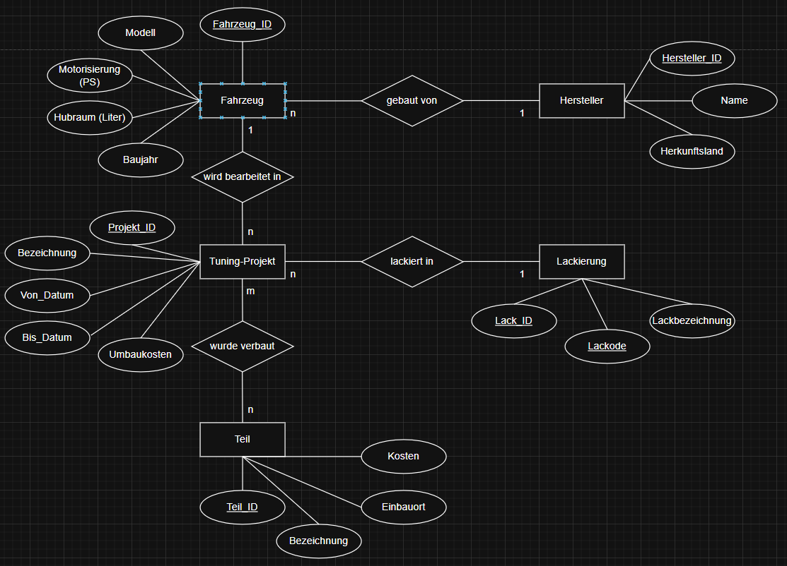
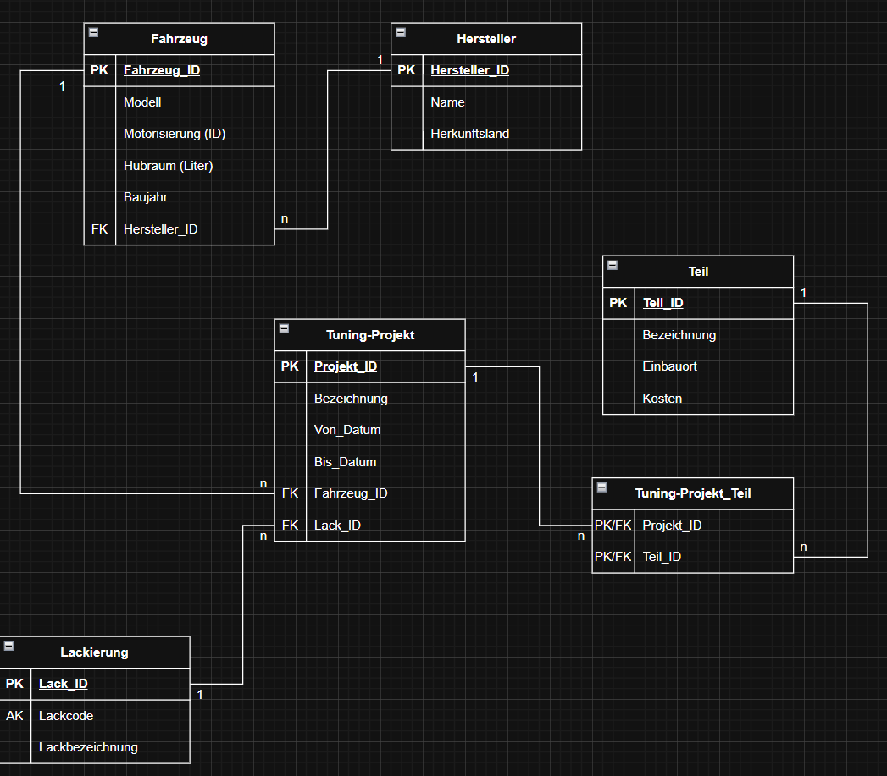
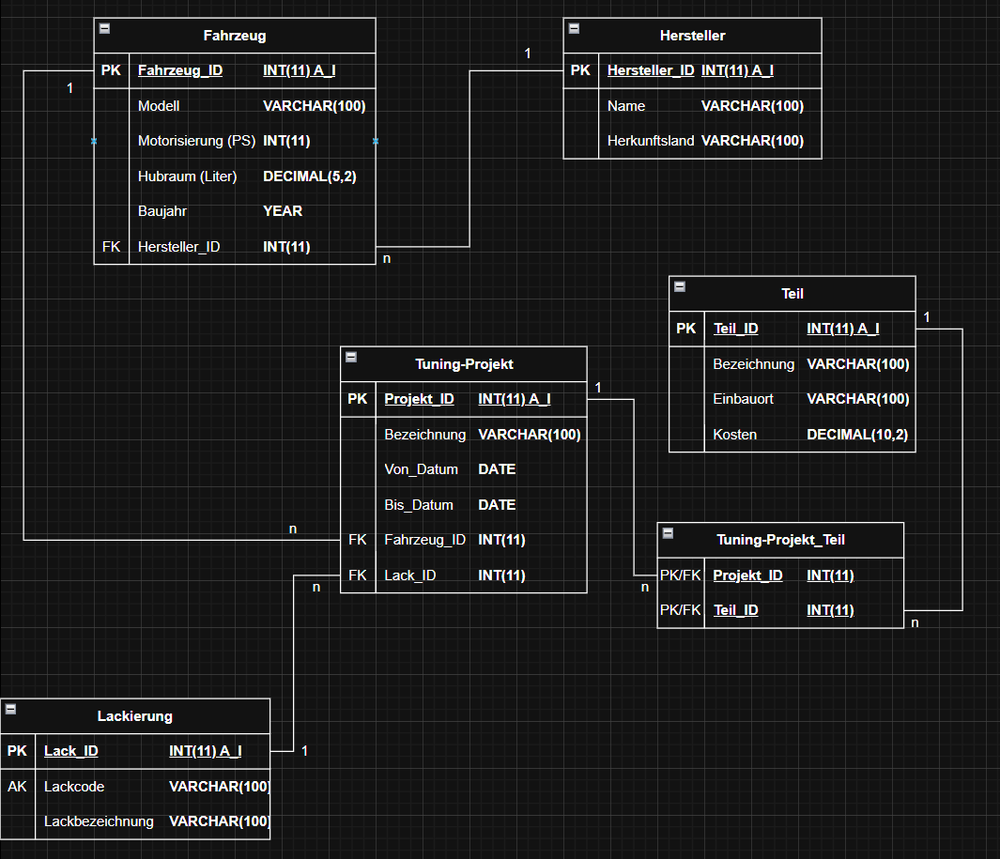

# SQL – Eigene erste Datenbank

Meine erste selbst entworfene relationale Datenbank,
entstanden während meiner Umschulung zur Fachinformatikerin
für Anwendungsentwicklung. 

## Thema

Eine Datenbank für meine fiktive Tuning-Garage.
Sie verwaltet Fahrzeuge, Hersteller, Tuning-Projekte,
verbaute Teile und Lackierungen.

## Datenbankmodellierung

### ERD (Entity-Relationship-Diagramm)

### Relationales Modell (logisch)

### Relationales Modell (physisch)

## Tabellenstruktur

| Tabelle | Inhalt |
|---|---|
| `hersteller` | Fahrzeughersteller mit Herkunftsland |
| `fahrzeug` | Fahrzeugmodelle mit PS, Hubraum, Baujahr |
| `lackierung` | Lackoptionen mit Code und Bezeichnung |
| `teil` | Tuningteile mit Einbauort und Kosten |
| `tuning_projekt` | Projekte mit Zeitraum, Fahrzeug und Lack |
| `tuning_projekt_teil` | Zuordnung: welche Teile in welchem Projekt |

## Konzepte

- Primär- und Fremdschlüssel
- 1:n Beziehungen (z.B. Hersteller → Fahrzeuge)
- n:m Beziehung (Projekte ↔ Teile) über Zwischentabelle
- AUTO_INCREMENT, UNIQUE Constraints

## Technologien

- MariaDB 10.4
- phpMyAdmin 5.2
- SQL (DDL - Data Definition Language & DML - Data Manipulation Language)

## Status

–> In Bearbeitung - Testdaten werden noch ergänzt
